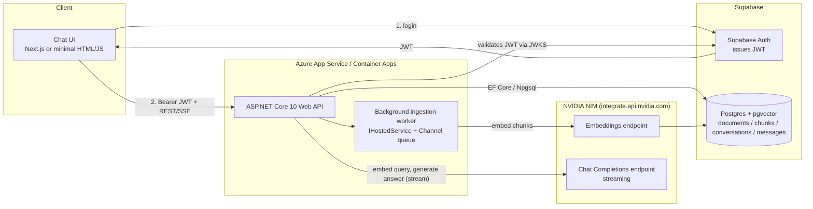
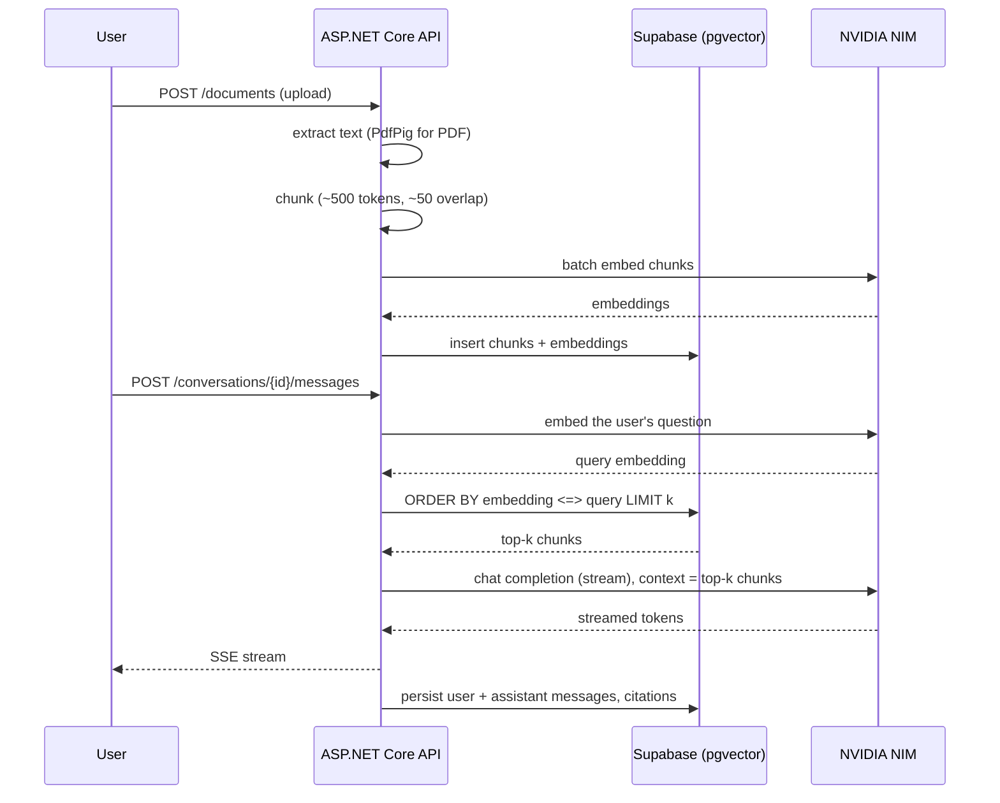

# TecAssist.NET — Technical Implementation Plan

A ground-up rebuild of **TecAssist** (your award-winning university project, later rebuilt as `TecAssist-Revisited` in Python/PyQt6) as a cloud-native **ASP.NET Core** backend with **Supabase (PostgreSQL + pgvector)** for data and vector storage. This version is designed specifically to close the ".NET evidence gap" on your resume: everything in it — the API, the data layer, the auth, the tests, the pipeline — is real, modern .NET work you can point a recruiter or interviewer at.

> **How to use this file:** commit it to the repo root as `IMPLEMENTATION.md` (or `docs/ARCHITECTURE.md`). It's the single source of truth while you build — architecture, schema, API contract, CI/CD, and a weekend-sized build order. Update it as you go; a well-maintained implementation doc is itself something an interviewer will notice.

---

## 1. Why This Project

| Resume gap (from our earlier review) | How this project closes it |
|---|---|
| ".NET" headline with only a 2007-era .NET Framework 3.5 app as evidence | Modern ASP.NET Core 10 Web API, EF Core 10, C# 13 |
| "Automated Testing" listed with no project behind it | xUnit unit + integration tests, `WebApplicationFactory`, Testcontainers |
| "CI/CD" only evidenced by a personal-site GitHub Actions setup | A real build → test → containerize → deploy pipeline |
| "Microsoft Azure" listed with no evidence | Actual deployment target: Azure App Service / Container Apps |
| No cloud-native backend project | REST API + streaming endpoint + Postgres + pgvector + JWT auth |

It also reuses what you already know (Supabase/Postgres from `wedproject`, the RAG concept and NVIDIA NIM API from `TecAssist-Revisited`) so the *new* surface area to learn is scoped tightly to ASP.NET Core itself.

---

## 2. Architecture at a Glance



**Request flow in one sentence:** the client logs in through Supabase Auth, calls the ASP.NET Core API with the resulting JWT, the API validates that JWT itself (it never talks to Supabase Auth per-request), and all document/vector storage lives in Supabase Postgres via EF Core + pgvector, while NVIDIA NIM supplies both embeddings and the streaming chat completion.

---

## 3. Tech Stack & Rationale

| Layer | Choice | Why |
|---|---|---|
| Runtime | .NET 10 (LTS) | Current LTS; matches what employers expect "current .NET" to mean |
| API | ASP.NET Core Web API, Minimal APIs or Controllers | Either is fine — pick Controllers if you want the pattern most job postings mention |
| ORM | EF Core 10 + `Npgsql.EntityFrameworkCore.PostgreSQL` | Standard .NET/Postgres pairing |
| Vector storage | Supabase Postgres + `vector` extension, via `Pgvector` + `Pgvector.EntityFrameworkCore` NuGet packages | No separate vector DB to run; reuses infra you already know from `wedproject` |
| LLM + Embeddings | NVIDIA NIM, OpenAI-wire-compatible (`https://integrate.api.nvidia.com/v1`) | Same provider as `TecAssist-Revisited` — real narrative continuity ("ported the pipeline to .NET, kept the model provider"); OpenAI-compatible schema means you can use the official `OpenAI` NuGet SDK pointed at NVIDIA's base URL |
| Auth | Supabase Auth issues the JWT; ASP.NET Core validates it as a pure resource server | No auth system to build; demonstrates JWT/JWKS knowledge instead of reinventing login |
| Testing | xUnit, `WebApplicationFactory<Program>`, `Testcontainers.PostgreSql` (`pgvector/pgvector` image) | Real integration tests against a real Postgres+pgvector container, not just mocks |
| CI/CD | GitHub Actions | Same tool you already used on your personal site |
| Hosting | Azure App Service for Containers (or Azure Container Apps) | Gives you real "Microsoft Azure" evidence |
| Logging | Serilog, structured JSON logs | Standard, resume-recognizable |
| Frontend (optional) | Minimal Next.js chat page, deployed to Vercel | Reuses your `wedproject` stack; not required for the backend story to be complete |

---

## 4. Solution Structure

Clean Architecture, four projects — enough to show you understand separation of concerns without over-engineering a portfolio piece:

```
TecAssist.NET.sln
├── src/
│   ├── TecAssist.Api/                 # ASP.NET Core host: controllers, DI wiring, Program.cs
│   ├── TecAssist.Application/         # Use cases: IngestDocument, SendMessage, SearchChunks (interfaces + services)
│   ├── TecAssist.Domain/              # Entities: Document, DocumentChunk, Conversation, Message (no external deps)
│   └── TecAssist.Infrastructure/      # EF Core DbContext, Npgsql/pgvector config, NVIDIA NIM client, JWKS auth
├── tests/
│   ├── TecAssist.UnitTests/           # Chunking, prompt building, DTO validation
│   └── TecAssist.IntegrationTests/    # WebApplicationFactory + Testcontainers Postgres
├── .github/workflows/ci-cd.yml
├── Dockerfile
└── IMPLEMENTATION.md                  # this file
```

Dependency direction: `Api → Application → Domain`, with `Infrastructure` implementing interfaces declared in `Application`. This is the one architectural detail worth being able to explain in an interview: *"Domain and Application don't reference Npgsql or the NVIDIA client directly — Infrastructure implements `IEmbeddingClient` and `IChatClient` interfaces, so the RAG logic is testable without a real database or API key."*

---

## 5. Data Model

Supabase gives you `auth.users` for free — don't build your own users table, just reference it.

```sql
-- Enable the vector extension (Supabase: do this via the Dashboard > Database > Extensions,
-- or in a migration: CREATE EXTENSION IF NOT EXISTS vector;)

create table documents (
    id            uuid primary key default gen_random_uuid(),
    user_id       uuid not null references auth.users(id) on delete cascade,
    title         text not null,
    source_type   text not null check (source_type in ('text','markdown','pdf')),
    status        text not null default 'pending' check (status in ('pending','processing','ready','failed')),
    created_at    timestamptz not null default now()
);

create table document_chunks (
    id             uuid primary key default gen_random_uuid(),
    document_id    uuid not null references documents(id) on delete cascade,
    chunk_index    int not null,
    content        text not null,
    token_count    int not null,
    -- match the dimension to your chosen NIM embedding model
    -- (check the model card on build.nvidia.com; catalog rotates: nvidia/nemotron-3-embed-1b is 2048-dim as of 2026-09; HNSW indexes cap at 2000 dims, so wider models use exact scans)
    embedding      vector(2048),
    created_at     timestamptz not null default now()
);

create table conversations (
    id          uuid primary key default gen_random_uuid(),
    user_id     uuid not null references auth.users(id) on delete cascade,
    title       text,
    created_at  timestamptz not null default now()
);

create table messages (
    id               uuid primary key default gen_random_uuid(),
    conversation_id  uuid not null references conversations(id) on delete cascade,
    role             text not null check (role in ('user','assistant')),
    content          text not null,
    created_at       timestamptz not null default now()
);

-- optional: which chunks an assistant answer actually cited, for a "sources" panel in the UI
create table message_citations (
    message_id  uuid not null references messages(id) on delete cascade,
    chunk_id    uuid not null references document_chunks(id) on delete cascade,
    primary key (message_id, chunk_id)
);

-- approximate nearest-neighbor index; cosine distance matches most text-embedding models
create index on document_chunks using hnsw (embedding vector_cosine_ops);

-- Row-Level Security: every table scoped to its owning user.
-- The Postgres role the API connects as should be a non-superuser that goes through RLS,
-- or you enforce ownership in the Application layer if you connect with the Supabase
-- service-role key. Prefer RLS if you can — it's one more thing you already know from wedproject.
alter table documents enable row level security;
create policy "own documents" on documents
    using (auth.uid() = user_id) with check (auth.uid() = user_id);

alter table conversations enable row level security;
create policy "own conversations" on conversations
    using (auth.uid() = user_id) with check (auth.uid() = user_id);

-- Child tables have no user_id column, but they MUST still get RLS: Supabase grants
-- anon/authenticated full DML on public tables by default, so without policies a leaked
-- anon key could read every user's chunks and messages through PostgREST (RLS is
-- per-table in Postgres — parent policies do not cascade). Scope them through their
-- parent rows. The executable, idempotent script lives at supabase/rls.sql:
alter table document_chunks enable row level security;
create policy "own document chunks" on document_chunks
    using (exists (select 1 from documents d where d.id = document_id and d.user_id = auth.uid()))
    with check (exists (select 1 from documents d where d.id = document_id and d.user_id = auth.uid()));

alter table messages enable row level security;
create policy "own messages" on messages
    using (exists (select 1 from conversations c where c.id = conversation_id and c.user_id = auth.uid()))
    with check (exists (select 1 from conversations c where c.id = conversation_id and c.user_id = auth.uid()));

alter table message_citations enable row level security;
create policy "own message citations" on message_citations
    using (exists (
        select 1 from messages m join conversations c on c.id = m.conversation_id
        where m.id = message_id and c.user_id = auth.uid()))
    with check (exists (
        select 1 from messages m join conversations c on c.id = m.conversation_id
        where m.id = message_id and c.user_id = auth.uid())
        and exists (
        select 1 from document_chunks k join documents d on d.id = k.document_id
        where k.id = chunk_id and d.user_id = auth.uid()));
```

**EF Core side** (`Pgvector.EntityFrameworkCore`, confirmed current as of this writing — works with EF Core 9 and 10):

```csharp
// Program.cs / DI registration
builder.Services.AddDbContext<TecAssistDbContext>(options =>
    options.UseNpgsql(connectionString, o => o.UseVector()));

// DbContext
protected override void OnModelCreating(ModelBuilder modelBuilder)
{
    modelBuilder.HasPostgresExtension("vector");
    modelBuilder.Entity<DocumentChunk>()
        .Property(c => c.Embedding)
        .HasColumnType("vector(2048)");
}

// Entity
public class DocumentChunk
{
    public Guid Id { get; set; }
    public Guid DocumentId { get; set; }
    public int ChunkIndex { get; set; }
    public string Content { get; set; } = "";
    public int TokenCount { get; set; }
    public Vector? Embedding { get; set; }   // Pgvector.Vector
}

// Similarity search (cosine distance operator is `<=>`)
var results = await db.DocumentChunks
    .Where(c => c.DocumentId == documentId || includeAllUserDocs)
    .OrderBy(c => c.Embedding!.CosineDistance(queryEmbedding))
    .Take(topK)
    .ToListAsync();
```

`dotnet add package Pgvector` and `dotnet add package Pgvector.EntityFrameworkCore` in `TecAssist.Infrastructure`.

---

## 6. API Surface

| Method | Route | Purpose |
|---|---|---|
| `POST` | `/api/documents` | Upload a document (multipart: file or raw text); returns `202 Accepted`, kicks off background ingestion |
| `GET` | `/api/documents` | List the caller's documents with status |
| `GET` | `/api/documents/{id}` | Document detail |
| `DELETE` | `/api/documents/{id}` | Delete a document and its chunks |
| `POST` | `/api/conversations` | Start a new conversation |
| `GET` | `/api/conversations` | List the caller's conversations |
| `GET` | `/api/conversations/{id}/messages` | Message history |
| `POST` | `/api/conversations/{id}/messages` | Send a message; **streams** the assistant's reply (Server-Sent Events) |
| `GET` | `/health` | Liveness |
| `GET` | `/health/ready` | Readiness (checks DB connectivity) |

**Streaming example** — this is the endpoint worth demoing in an interview:

```http
POST /api/conversations/{id}/messages
Authorization: Bearer <supabase-jwt>
Content-Type: application/json

{ "content": "What did the Q3 report say about voltage compliance?" }
```

Response, `Content-Type: text/event-stream`:

```
event: token
data: {"text":"Based"}

event: token
data: {"text":" on the"}

event: citation
data: {"chunkId":"...","documentTitle":"Q3 Report.pdf"}

event: done
data: {"messageId":"..."}
```

Implement this with `IAsyncEnumerable<string>` from the NVIDIA NIM streaming response, written out via `HttpResponse.WriteAsync` under `text/event-stream` — ASP.NET Core supports this natively without extra packages.

---

## 7. RAG Pipeline



1. **Ingest** — extract text (`UglyToad.PdfPig` for PDFs; plain read for `.txt`/`.md`).
2. **Chunk** — fixed-size, token-aware chunking with overlap. A word-count approximation is fine for a v1; `Microsoft.ML.Tokenizers` (or `SharpToken`) gets you closer to how NIM's models actually tokenize if you want to be precise.
3. **Embed** — batch calls to NIM's `/v1/embeddings` (OpenAI-compatible schema; the official `OpenAI` NuGet SDK works against NVIDIA's base URL by just changing `Endpoint`).
4. **Store** — insert chunk rows with their `Vector` via EF Core.
5. **Retrieve** — embed the incoming question, run the pgvector cosine-distance query for top-k chunks.
6. **Augment** — build a system prompt: instructions + the retrieved chunk text + citations metadata.
7. **Generate** — call NIM chat completions with `stream: true`; forward tokens to the client as SSE.
8. **Persist** — save both messages and which chunks were cited, for the "sources" panel.

**Optional stretch:** hybrid search — combine the pgvector cosine search with Postgres full-text search (`tsvector`/`ts_rank`) and merge results. Worth a paragraph in the README if you build it; not required for the MVP.

---

## 8. Auth: Supabase JWT → ASP.NET Core

The API is a pure **resource server** — it never handles login itself. The client authenticates directly against Supabase Auth and attaches the resulting JWT.

Supabase has been migrating projects from a single shared HS256 secret to **asymmetric JWT signing keys** (ES256/RS256) with a public JWKS endpoint at `https://<project-ref>.supabase.co/auth/v1/jwks`; new projects default to this. Check **Project Settings → JWT** in your Supabase dashboard to see which mode your project is in, and build against that.

```csharp
builder.Services.AddAuthentication(JwtBearerDefaults.AuthenticationScheme)
    .AddJwtBearer(options =>
    {
        options.TokenValidationParameters = new TokenValidationParameters
        {
            ValidateIssuer = true,
            ValidIssuer = $"{supabaseUrl}/auth/v1",
            ValidateAudience = true,
            ValidAudience = "authenticated",
            ValidateLifetime = true,

            // New (asymmetric) projects: resolve signing keys from the JWKS endpoint,
            // cached and refreshed periodically (e.g. every 10 minutes) rather than
            // fetched per request. A small IMemoryCache-backed fetcher is enough.
            IssuerSigningKeyResolver = (token, securityToken, kid, parameters)
                => JwksProvider.GetSigningKeys(),

            // Legacy (symmetric) projects instead set:
            // IssuerSigningKey = new SymmetricSecurityKey(Encoding.UTF8.GetBytes(jwtSecret)),
        };
    });

builder.Services.AddAuthorization();
// ...
app.UseAuthentication();
app.UseAuthorization();
```

`JwksProvider` is a small service that fetches `GET /auth/v1/jwks`, parses it into a `JsonWebKeySet`, caches the resulting `SecurityKey`s for ~10 minutes, and refreshes on cache miss. Keep it simple — a `HttpClient` + `IMemoryCache` is enough; you don't need a full OpenID Connect discovery client since Supabase currently only exposes the bare JWKS document. **Verify the exact endpoint and claim names against Supabase's current Auth docs when you build this** — this is an area Supabase has actively been changing.

Row-Level Security in Postgres (Section 5) gives you defense in depth: even if an authorization check in the API were ever wrong, the database itself won't return another user's rows.

---

## 9. Testing Strategy

| Type | Tool | What it covers |
|---|---|---|
| Unit | xUnit | Chunking logic, prompt construction, DTO/request validation — no I/O |
| Unit | xUnit + a fake `IEmbeddingClient` / `IChatClient` | Application-layer services (`SendMessageHandler`, `IngestDocumentHandler`) without hitting NVIDIA NIM |
| Integration | xUnit + `WebApplicationFactory<Program>` + `Testcontainers.PostgreSql` (use the `pgvector/pgvector:pg16` image so the `vector` extension is present) | Real HTTP requests through the full pipeline against a real (ephemeral) Postgres, with the NIM client swapped for a fake via DI |
| Contract | xUnit | The SSE endpoint emits well-formed `event:`/`data:` frames in the right order |

Because `Infrastructure` implements `IEmbeddingClient`/`IChatClient` interfaces declared in `Application`, integration tests can register a fake implementation in the test host's DI container and never call NVIDIA NIM at all — fast, deterministic, no API key needed in CI.

---

## 10. CI/CD — GitHub Actions

`.github/workflows/ci-cd.yml`:

```yaml
name: CI/CD

on:
  push:
    branches: [main]
  pull_request:
    branches: [main]

jobs:
  build-and-test:
    runs-on: ubuntu-latest
    services:
      postgres:
        image: pgvector/pgvector:pg16
        env:
          POSTGRES_PASSWORD: postgres
        ports: ["5432:5432"]
        options: >-
          --health-cmd pg_isready
          --health-interval 10s
          --health-timeout 5s
          --health-retries 5
    steps:
      - uses: actions/checkout@v4
      - uses: actions/setup-dotnet@v4
        with:
          dotnet-version: "10.0.x"
      - run: dotnet restore
      - run: dotnet build --no-restore -c Release
      - run: dotnet test --no-build -c Release --logger "trx" --results-directory TestResults
        env:
          ConnectionStrings__Default: "Host=localhost;Database=postgres;Username=postgres;Password=postgres"
      - uses: actions/upload-artifact@v4
        if: always()
        with:
          name: test-results
          path: TestResults

  build-and-push-image:
    needs: build-and-test
    if: github.ref == 'refs/heads/main'
    runs-on: ubuntu-latest
    permissions:
      contents: read
      packages: write
    steps:
      - uses: actions/checkout@v4
      - uses: docker/login-action@v3
        with:
          registry: ghcr.io
          username: ${{ github.actor }}
          password: ${{ secrets.GITHUB_TOKEN }}
      - uses: docker/build-push-action@v6
        with:
          context: .
          push: true
          tags: ghcr.io/${{ github.repository }}:${{ github.sha }},ghcr.io/${{ github.repository }}:latest

  deploy:
    needs: build-and-push-image
    if: github.ref == 'refs/heads/main'
    runs-on: ubuntu-latest
    steps:
      - uses: azure/webapps-deploy@v3
        with:
          app-name: ${{ vars.AZURE_APP_NAME }}
          publish-profile: ${{ secrets.AZURE_PUBLISH_PROFILE }}
          images: ghcr.io/${{ github.repository }}:${{ github.sha }}
```

Add a status badge to the repo README once this is green:
`` — small, but it's exactly the kind of thing a recruiter notices in ten seconds.

---

## 11. Deployment

`Dockerfile` (multi-stage, standard for ASP.NET Core):

```dockerfile
FROM mcr.microsoft.com/dotnet/sdk:10.0 AS build
WORKDIR /src
COPY . .
RUN dotnet restore
RUN dotnet publish src/TecAssist.Api -c Release -o /app

FROM mcr.microsoft.com/dotnet/aspnet:10.0 AS runtime
WORKDIR /app
COPY --from=build /app .
EXPOSE 8080
ENV ASPNETCORE_URLS=http://+:8080
ENTRYPOINT ["dotnet", "TecAssist.Api.dll"]
```

Target **Azure App Service for Containers** (Linux) for the simplest setup, or **Azure Container Apps** if you want to talk about scale-to-zero and revisions in interviews — both are legitimate "Microsoft Azure" resume evidence. Either way:

- Store secrets (Supabase connection string, NVIDIA NIM API key, JWT settings) as App Service **Application Settings**, or reference them from **Azure Key Vault** if you want another checkbox for "cloud security practices."
- Supabase hosts Postgres + Auth for you — nothing to self-host on the data side.

---

## 12. Configuration

| Variable | Purpose |
|---|---|
| `ConnectionStrings__Default` | Supabase Postgres connection string (use the pooled/`Session` mode connection string from Supabase, not the direct one, for a hosted API) |
| `Supabase__Url` | `https://<project-ref>.supabase.co` |
| `Supabase__JwksUrl` | `https://<project-ref>.supabase.co/auth/v1/jwks` (or legacy `Supabase__JwtSecret`) |
| `Nvidia__ApiKey` | `nvapi-...` from build.nvidia.com |
| `Nvidia__BaseUrl` | `https://integrate.api.nvidia.com/v1` |
| `Nvidia__ChatModel` | e.g. a Llama or Nemotron chat model id from the NIM catalog |
| `Nvidia__EmbeddingModel` | e.g. nvidia/nemotron-3-embed-1b (2048-dim) from the NIM catalog |

Use `dotnet user-secrets` locally; never commit real values. A `.env.example` / `appsettings.Example.json` with the keys (no values) is good practice and something reviewers look for.

---

## 13. Observability

- **Serilog** with structured JSON console logging (reads cleanly in Azure Log Stream / App Insights).
- `/health` and `/health/ready` via `Microsoft.Extensions.Diagnostics.HealthChecks`, with a Postgres check on the readiness endpoint.
- Optional stretch: wire up **Application Insights** (`Microsoft.ApplicationInsights.AspNetCore`) — one line in `Program.cs`, and it's a very recognizable name on a resume bullet.

---

## 14. Build Plan (weekend-sized, phased)

**MVP cut line:** Phases 1–4 are the resume-worthy minimum. Phases 5–6 are what take this from "solid" to "impressive" — do them if you have the time, skip them without guilt if you don't.

1. **Skeleton** — solution structure, EF Core `DbContext` + initial migration against a local Supabase project, health endpoints, Dockerfile that runs locally.
2. **RAG core** — document upload → chunk → embed → store; query → retrieve → generate, non-streaming first. Get this working end-to-end with Postman/curl before touching streaming or auth.
3. **Streaming + Auth** — convert chat generation to SSE; add Supabase JWT validation and RLS; lock every endpoint behind `[Authorize]`.
4. **Tests + CI** — unit tests for chunking/prompting, integration tests against Testcontainers, GitHub Actions workflow green on every push.
5. **Deploy** — containerize, push to Azure, wire the pipeline's deploy job, confirm the live URL works with a real Supabase project.
6. **Polish (stretch)** — hybrid search, citations UI, Application Insights, a minimal Next.js chat page on Vercel that talks to the deployed API.

---

## 15. Resume Bullets (draft — finalize once built)

> Keep these as drafts. Don't add them to your resume until the repo, CI badge, and live deployment actually back them up.

- Rebuilt a RAG-based AI assistant as an ASP.NET Core 10 Web API with EF Core, Supabase (PostgreSQL + pgvector), and streaming chat completions via the NVIDIA NIM API.
- Implemented JWT-based authentication (Supabase Auth + JWKS validation) and Postgres row-level security to scope all data access per user.
- Built a CI/CD pipeline in GitHub Actions running xUnit unit and Testcontainers-based integration tests on every push, with automated Docker builds and deployment to Azure App Service.

---

## 16. References Worth Re-checking at Build Time

APIs in this space move quickly — re-verify these against current docs before you lean on them:

- Supabase JWT signing keys / JWKS migration: `supabase.com/docs/guides/auth/signing-keys`
- pgvector for .NET: `github.com/pgvector/pgvector-dotnet`
- NVIDIA NIM API catalog and model IDs: `build.nvidia.com`
- `Testcontainers.PostgreSql` for .NET: `dotnet.testcontainers.org`
