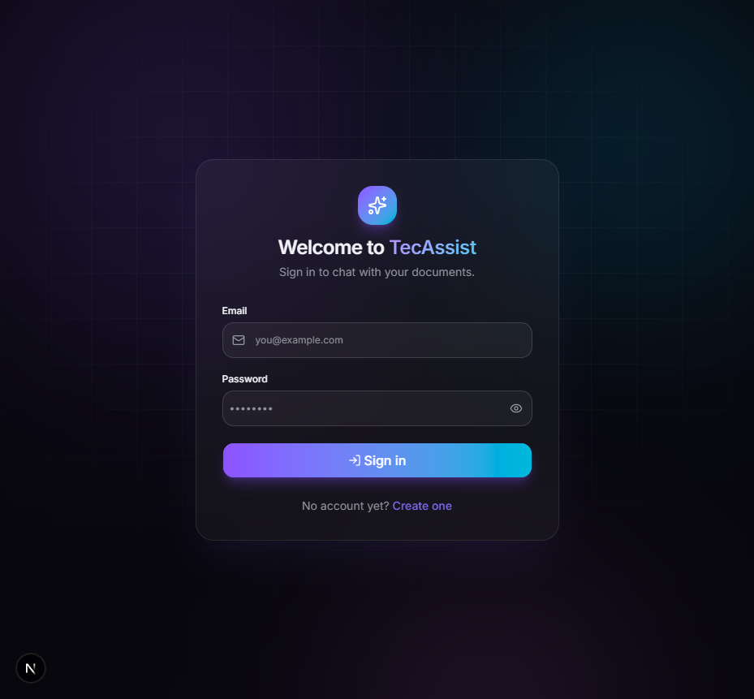
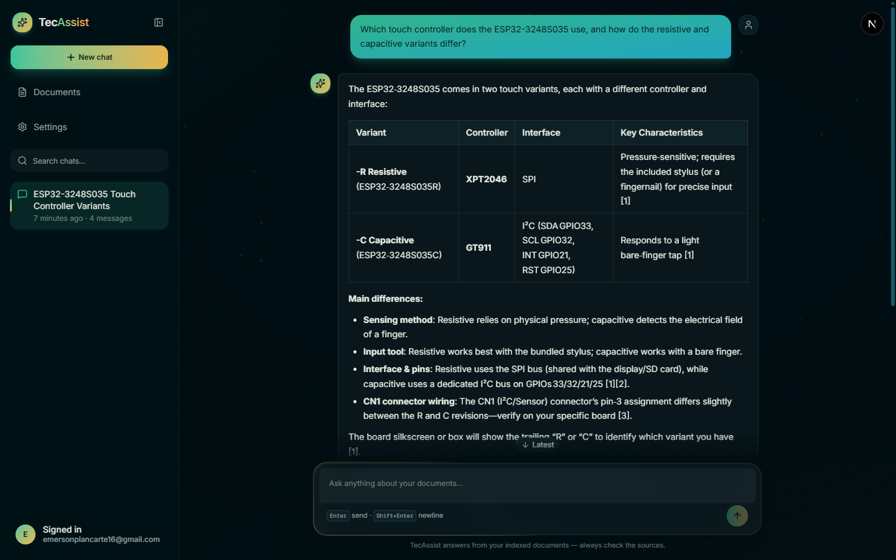
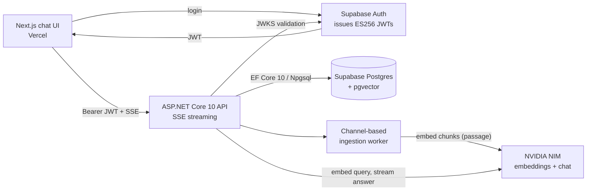

# TecAssist.NET

**A RAG-powered technical assistant, end to end** — an ASP.NET Core 10 Web API with Supabase (PostgreSQL + pgvector) for storage, NVIDIA NIM for embeddings and streaming chat, and a polished Next.js chat UI. Every answer is grounded in your uploaded documents and cites its sources.






## Highlights

- **Retrieval-Augmented Generation** — upload PDFs, Markdown or plain text; documents are chunked, embedded with NVIDIA NIM (`nvidia/nemotron-3-embed-1b`) and stored in pgvector.
- **Streaming answers** — chat completions stream to the browser over Server-Sent Events (`token` → `citation` → `done` frames), rendered live with a typing caret.
- **Cited answers** — the model cites its sources inline (`[1]`, `[2]`); every citation is persisted and displayed with a similarity score.
- **JWT resource server** — Supabase Auth issues ES256 tokens; the API validates them against the project's JWKS endpoint (no login system to maintain).
- **Defense in depth** — ownership is enforced in the Application layer *and* by Postgres Row-Level Security on every user-scoped table.
- **42 automated tests** — 30 unit tests plus 12 integration tests against a real ephemeral `pgvector/pgvector` container via Testcontainers, including an SSE wire-format contract test.

## Architecture



Full detail in [docs/ARCHITECTURE.md](docs/ARCHITECTURE.md) · API reference in [docs/API.md](docs/API.md) · Deployment in [DEPLOYMENT.md](DEPLOYMENT.md).

## Quickstart

Prerequisites: [.NET 10 SDK](https://dotnet.microsoft.com/download/dotnet/10.0), Node 20+, Docker (for integration tests), a [Supabase](https://supabase.com) project, and an NVIDIA NIM API key from [build.nvidia.com](https://build.nvidia.com).

### 1. Database

In the Supabase SQL Editor, run in order:

1. [`supabase/schema.sql`](supabase/schema.sql) — idempotent schema (tables, `vector` extension, check constraints).
2. [`supabase/rls.sql`](supabase/rls.sql) — `auth.users` foreign keys + Row-Level Security on all five tables.

### 2. Backend

```powershell
dotnet tool restore
dotnet user-secrets set "ConnectionStrings:Default" "Host=<pooler-host>;Port=5432;Database=postgres;Username=postgres.<ref>;Password=<password>" --project src/TecAssist.Api
dotnet user-secrets set "Nvidia:ApiKey" "nvapi-..." --project src/TecAssist.Api
dotnet user-secrets set "Supabase:Url" "https://<ref>.supabase.co" --project src/TecAssist.Api

dotnet run --project src/TecAssist.Api
```

The API serves at `http://localhost:5028` (OpenAPI document at `/openapi/v1.json` in development).

### 3. Frontend

```powershell
cd web
Copy-Item .env.example .env.local   # fill in your Supabase URL, publishable key, API URL
npm install
npm run dev
```

The app serves at `http://localhost:3000`.

## API Surface

| Method | Route | Purpose |
|---|---|---|
| `POST` | `/api/documents` | Upload a file (multipart, `.pdf`/`.md`/`.txt`) → `202`, background ingestion |
| `POST` | `/api/documents/text` | Create a document from pasted text → `202` |
| `GET` | `/api/documents` | List your documents with status + chunk counts |
| `GET` `/api/documents/{id}` | | Document detail |
| `DELETE` | `/api/documents/{id}` | Delete document + chunks |
| `POST` | `/api/conversations` | Start a conversation (auto-titled from the first message) |
| `GET` | `/api/conversations` | List your conversations |
| `PATCH`/`DELETE` | `/api/conversations/{id}` | Rename / delete a conversation |
| `GET` | `/api/conversations/{id}/messages` | Message history with citations |
| `POST` | `/api/conversations/{id}/messages` | Ask — **streams the reply over SSE** |
| `POST` | `/api/conversations/{id}/title` | Generate a short AI title from the first exchange |
| `GET` | `/health`, `/health/ready` | Liveness / readiness (DB probe) |

## Testing

```powershell
dotnet test TecAssist.NET.slnx -c Release
```

- **Unit tests** — chunking, citation parsing, prompt construction, chat/ingestion services with fakes, JWKS caching.
- **Integration tests** — `WebApplicationFactory<Program>` + Testcontainers spins up a real Postgres 16 container with pgvector; NVIDIA clients are replaced with fakes via DI. Includes a full SSE wire-format contract test.

## Tech Stack

| Layer | Technology |
|---|---|
| Backend | ASP.NET Core 10 (controllers), EF Core 10, Serilog (compact JSON), xUnit + Testcontainers |
| Data | Supabase Postgres 15+ with pgvector, Row-Level Security, HNSW-ready |
| AI | NVIDIA NIM — `nvidia/nemotron-3-embed-1b` (embeddings), `nvidia/nemotron-3-ultra-550b-a55b` (chat, streaming) |
| Auth | Supabase Auth (ES256 JWTs) validated in-process via JWKS with a 10-minute in-memory cache |
| Frontend | Next.js 16 (App Router, proxy), React 19, Tailwind CSS 4, shadcn/ui, Motion, Supabase SSR auth |
| CI/CD | GitHub Actions — test, build image → GHCR; Azure App Service deploy job (pre-wired, enable when ready) |

## Repository Layout

```
├── src/
│   ├── TecAssist.Api/            # host: controllers, auth, middleware, Program.cs
│   ├── TecAssist.Application/    # use cases: RAG services, abstractions, contracts
│   ├── TecAssist.Domain/         # entities (no infrastructure dependencies)
│   └── TecAssist.Infrastructure/ # EF Core, pgvector, NVIDIA clients, JWKS, ingestion worker
├── tests/
│   ├── TecAssist.UnitTests/
│   └── TecAssist.IntegrationTests/
├── web/                          # Next.js chat UI
├── supabase/                     # schema.sql + rls.sql (apply in the SQL Editor)
├── scripts/smoke-test.ps1         # end-to-end smoke test against a running API
├── Dockerfile                     # multi-stage API image
└── IMPLEMENTATION.md              # the build plan this project was executed from
```
